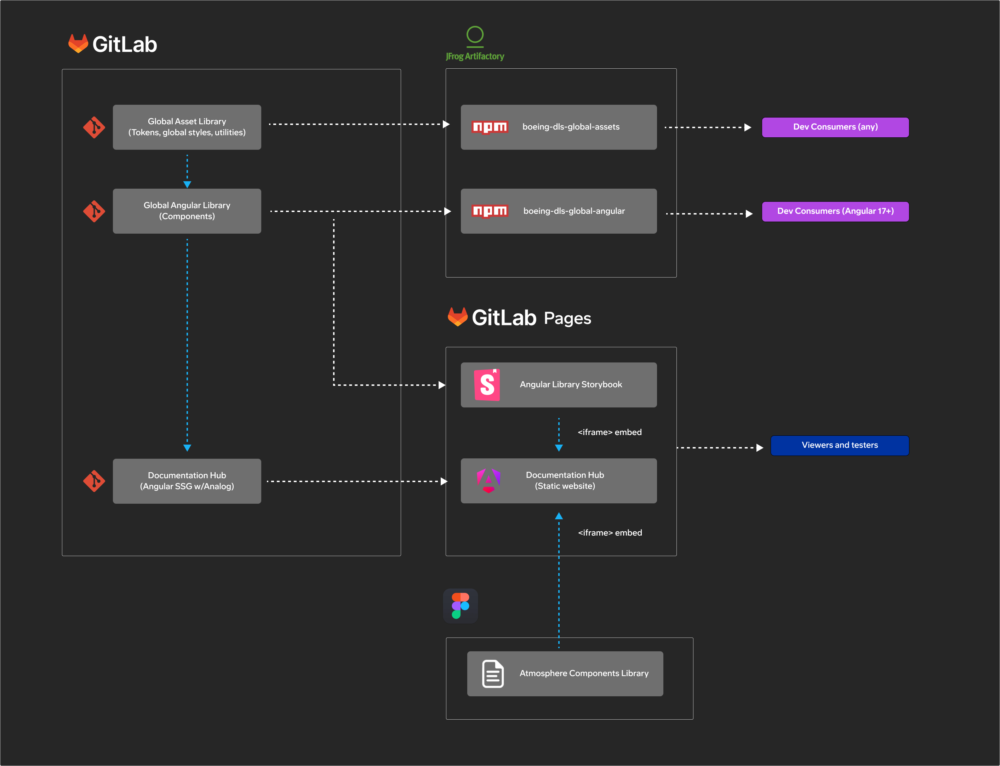

# Boeing DLS Global Documentation Hub

## Ecosystem



## Setup

This project was generated with [Angular CLI](https://github.com/angular/angular-cli) version 20.3.15.

### Create an .npmrc

Public NPM packages will be installed from the Boeing SRES package repository (Jfrog Artifactory) and private NPM packages (`@jeppesen-foreflight/dls-global-assets`) will be downloaded from the Boeing GitLab package registry. To enable this, create a new filed named `.npmrc` in the project root. The content should be:

Replace the following values:

### Install packages

```sh
npm install
```

> If npm install fails because it can't connect to Artifactory, it may help to first run `npm config set strict-ssl false`

## Local development

The Boeing DLS Global Documentation Hub has a dependency on the Boeing DLS Global Angular Library (`@jeppesen-foreflight/dp-dls-global-angular`).

The package `@jeppesen-foreflight/dp-dls-global-angular` will be downloaded from the GitLab package registry, as long as the `.npmrc` file is present, as described above.

The package `@jeppesen-foreflight/dls-global-assets` will be also downloaded because it is a dependency of `@jeppesen-foreflight/dp-dls-global-angular`.

During ongoing development, it may be useful to have local changes made to the `@jeppesen-foreflight/dls-global-assets` and `@jeppesen-foreflight/dp-dls-global-angular` packages reflect immediately in the `dls-global-docs` project. To enable this, create a NPM symlink.

1. In the `dls-global-assets` directory, run `npm link`. This command creates a global symlink to the package.

2. In the `dp-dls-global-angular` directory, run `npm link`. This command creates a global symlink to the package.

3. In the `dls-global-docs` directory, run `npm link @jeppesen-foreflight/dls-global-assets` to link the local version of `@jeppesen-foreflight/dls-global-assets` to the project. This allows you to work with the package locally and have your changes reflected immediately without publishing a new version to the NPM registry.

4. In the `dls-global-docs` directory, also run `npm link @jeppesen-foreflight/dp-dls-global-angular` to link the local version of `@jeppesen-foreflight/dp-dls-global-angular` to the project.

*Note:* If you run `npm install` after creating the symlinks, you need to recreate them by doing steps 3 and 4 above.

## Development server

Run `npm run start` for a dev server. Navigate to `http://localhost:4200/`. The application will automatically reload if you change any of the source files.

## Build

Run `npm run build` to build the project. The build artifacts will be stored in the `dist/` directory.

## Running unit tests

Run `npm run test` to execute the unit tests via [Karma](https://karma-runner.github.io).
# Trigger Pages deployment
